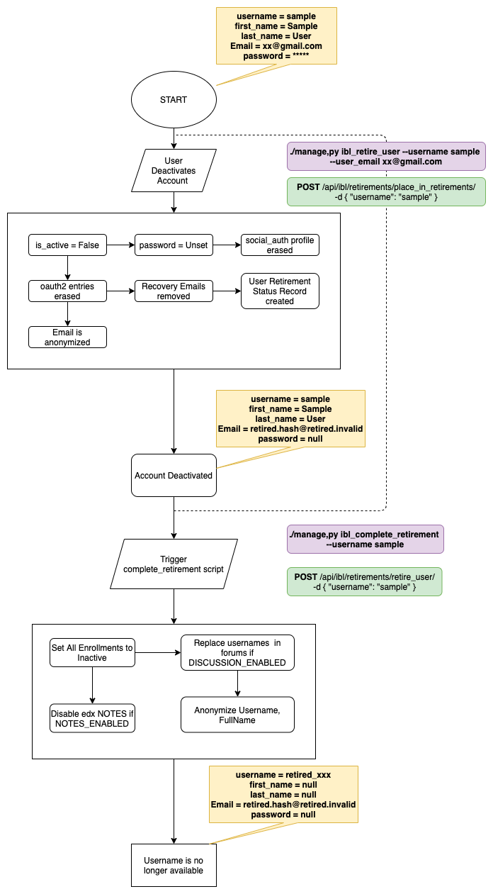

## IBL EDX GDPR API
This is a wrapper edX app that performs the extra retirement steps once a user requires his account to be deactivated


Install via `sudo -Hu edxapp /edx/app/edxapp/venvs/edxapp/bin/pip install \
    git+https://gitlab.com/iblstudios/ibl-edx-gdpr.git`


## Setup
1. Enable retirement in LMS `/lms/envs/common.py` , ensure 
    ```
    FEATURES = {
        ...
        "ACCOUNT_DELETION": True,
        ...
    }
    ```


2. Set ``HOST = <your-edx-domain>``  in `lms/envs/common.py` to ensure the script works
    - Optional settings
    
        `IBL_GDPR_USE_HTTPS=False/True <either to connect to HOST using https or http>` 

3. In `lms/envs/common.py`  add `ibl_edx_gdpr` to `INSTALLED_APPS`:
    
    ```python
    INSTALLED_APPS = [
        #...
        'ibl_edx_gdpr'
        #...
    ]
    ```
  
 
4. Configure in `lms.env.json`   SALT (For email and username hashing ) and RETIREMENT_SERVICE_WORKER_USERNAME 
   (Only user asides superusers, authorized to perform retirements)
   
    ```
        RETIRED_USER_SALTS = ['some-Complicated-something', 'some-Complicated-something']
        RETIREMENT_SERVICE_WORKER_USERNAME = ibl.retirement.user
    ```

5. (_Optional_) In `lms/urls.py` Add URL pattern for retirements API endpoints if needed.

    ```python
    urlpatterns += (
        url(r'^api/ibl/retirements/', include('ibl_edx_gdpr.urls')),
    )
    ```

6. Restart the lms

**NOTE**: After these steps are done, 
1. Retirement States Model would be automatically populated with the right RETIREMENT_STATES
2. A new user `ibl.retirement.user` would be created
3. A new Django Oauth Toolkit Application `IBL Retirement App` would be created, (use the credentials for calling the API)


## Helpful Commands
### Install
```shell
sudo -Hu edxapp /edx/app/edxapp/venvs/edxapp/bin/pip install \
    git+https://gitlab.com/iblstudios/ibl-edx-gdpr.git
```

### Reinstall
```shell
sudo -Hu edxapp /edx/app/edxapp/venvs/edxapp/bin/pip install --upgrade --no-deps --force-reinstall \
    git+https://gitlab.com/iblstudios/ibl-edx-gdpr.git
```

### Uninstall
```shell
sudo -Hu edxapp /edx/app/edxapp/venvs/edxapp/bin/pip uninstall ibl_edx_gdpr
```

## USAGE
The application can easily retire a learner in two Scenario

### Scenario 1 (User in Retirement Pipeline )

Profile Deactivation/Retirement was/is initiated by the user in his user dashboard
   
* If user has already clicked the ``DELETE MY ACCOUNT`` button in his profile.
   


* Run the `ibl_complete_retirement` command
  
  ```
      ./manage.py lms ibl_complete_retirement --username ibltestuser
  
        b'Learner Retirement: (ibltestuser) Starting state RETIRING_ENROLLMENTS'
        b'Learner Retirement: (ibltestuser) State RETIRING_ENROLLMENTS completed in 0.11639761924743652 seconds'
        b'Learner Retirement: (ibltestuser) Progressing to state ENROLLMENTS_COMPLETE'
        b'Learner Retirement: (ibltestuser) Starting state RETIRING_LMS'
        b'Learner Retirement: (ibltestuser) State RETIRING_LMS completed in 0.10183119773864746 seconds'
        b'Learner Retirement: (ibltestuser) Progressing to state LMS_COMPLETE'
        b'Learner Retirement: (ibltestuser) Retirement complete for learner ibltestuser' 
    ```

### Scenario 2 (Manual Retirement)
User does not exist in retirement pipeline, we would need to deactivate/retire a user profile without needing the user to click deactivate` in account settings.

**Note** This is a more likely scenerio
* Add User to Retirement Pipeline
   ```ssh
   ./manage.py lms ibl_retire_user --username ibluser --user_email ibluser@ibleducation.com
   
   User successfully moved to the retirement pipeline
   ```
* Run the ibl_complete_retirement command
    ```ssh
      ./manage.py lms ibl_complete_retirement --username ibltestuser
  
        b'Learner Retirement: (ibltestuser) Starting state RETIRING_ENROLLMENTS'
        b'Learner Retirement: (ibltestuser) State RETIRING_ENROLLMENTS completed in 0.11639761924743652 seconds'
        b'Learner Retirement: (ibltestuser) Progressing to state ENROLLMENTS_COMPLETE'
        b'Learner Retirement: (ibltestuser) Starting state RETIRING_LMS'
        b'Learner Retirement: (ibltestuser) State RETIRING_LMS completed in 0.10183119773864746 seconds'
        b'Learner Retirement: (ibltestuser) Progressing to state LMS_COMPLETE'
        b'Learner Retirement: (ibltestuser) Retirement complete for learner ibltestuser'
      
    ```

## Using the API

See [USAGE](USAGE.md) for how to use with API, Go to admin, Applications and use the IBL Retirement App Credentials to 
authenticate with the API

## Debugging
1. JSONDecodeError
    * Check that the HOST variable is valid
    
2. Learner Retirement: Learner retire2@retire.com not found. Please check that the learner is present in UserRetirementStatus, is not already retired, and is in an appropriate state to be acted upon.
    * Run the `ìbl_retire_user` command passing the username and email as params

3. Connection Refused 
    * Check if the current can access the url set in ``HOST``
    * Turn off HTTPS by setting `IBL_GDPR_USE_HTTPS` to `False`

## Process Flow
