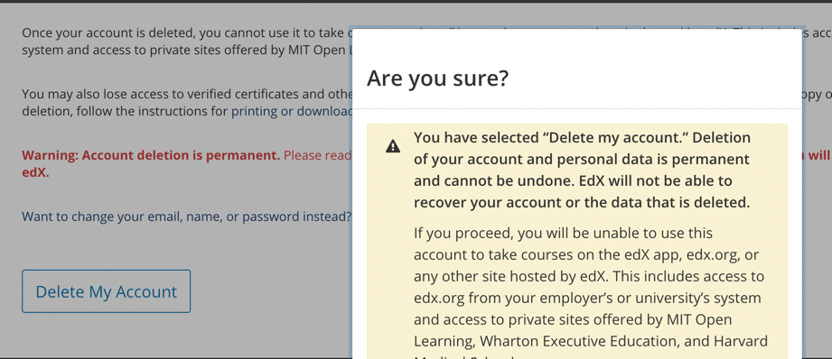

## IBL EDX GDPR API
This is a wrapper edX app that performs the extra retirement steps once a user requires his account to be deactivated


## Setup
### edX Server Setup
1. Enable retirement in LMS, ensure 
    ```
    FEATURES = {
        ...
        "ACCOUNT_DELETION": True,
        ...
    }
    ```

[comment]: <> (2. Set RETIREMENT_STATES using the ``./manage.py lms ibl_retirement_states`` or via the API 'api/user_api/populate_retirement')

[comment]: <> (```)

[comment]: <> (RETIREMENT_STATES = [)

[comment]: <> (    'PENDING',)

[comment]: <> (    'LOCKING_ACCOUNT',)

[comment]: <> (    'LOCKING_COMPLETE',)

[comment]: <> (    # Use these states only when ENABLE_DISCUSSION_SERVICE is True.)

[comment]: <> (    'RETIRING_FORUMS',)

[comment]: <> (    'FORUMS_COMPLETE',)

[comment]: <> (    'RETIRING_EMAIL_LISTS',)

[comment]: <> (    'EMAIL_LISTS_COMPLETE',)

[comment]: <> (    'RETIRING_ENROLLMENTS',)

[comment]: <> (    'ENROLLMENTS_COMPLETE',)

[comment]: <> (    # Use these states only when ENABLE_STUDENT_NOTES is True.)

[comment]: <> (    'RETIRING_NOTES',)

[comment]: <> (    'NOTES_COMPLETE',)

[comment]: <> (    'RETIRING_LMS',)

[comment]: <> (    'LMS_COMPLETE',)

[comment]: <> (    'ERRORED',)

[comment]: <> (    'ABORTED',)

[comment]: <> (    'COMPLETE',)

[comment]: <> (])

[comment]: <> (```)

2. **Important**, configure SALT and Retirement service worker that would be used for email and username hashing
    ```
    RETIRED_USER_SALTS = ['some-Complicated-something', 'some-Complicated-something']
    RETIREMENT_SERVICE_WORKER_USERNAME = ibl.retirement.user
    ```

3. **IMPORTANT** Set a ``HOST = <your-edx-domain>``  to ensure the script works


4. In `lms/envs/common.py` and/or `cms/envs/common.py`, add `ibl_edx_gdpr` to `INSTALLED_APPS`:
    
    ```python
    INSTALLED_APPS = [
        #...
        'ibl_edx_gdpr'
        #...
    ]
    ```

### Install command
#### Install
```shell
sudo -Hu edxapp /edx/app/edxapp/venvs/edxapp/bin/pip install \
    git+https://gitlab.com/iblstudios/ibl-edx-gdpr.git
```

#### Reinstall
```shell
sudo -Hu edxapp /edx/app/edxapp/venvs/edxapp/bin/pip install --upgrade --no-deps --force-reinstall \
    git+https://gitlab.com/iblstudios/ibl-edx-gdpr.git
```

#### Uninstall
```shell
sudo -Hu edxapp /edx/app/edxapp/venvs/edxapp/bin/pip uninstall ibl_edx_gdpr
```


## Commands
The application can easily retire a learner in two Scenario

### Scenario 1 (User in Retirement Pipeline )

Profile Deactivation/Retirement was/is initiated by the user in his user dashboard
   
* If user has already clicked the ``DELETE MY ACCOUNT`` button in his profile.
   


* Run the `ibl_complete_retirement` command
  
  ```
      ./manage.py lms ibl_complete_retirement --username ibltestuser
  
        b'Learner Retirement: (ibltestuser) Starting state RETIRING_ENROLLMENTS'
        b'Learner Retirement: (ibltestuser) State RETIRING_ENROLLMENTS completed in 0.11639761924743652 seconds'
        b'Learner Retirement: (ibltestuser) Progressing to state ENROLLMENTS_COMPLETE'
        b'Learner Retirement: (ibltestuser) Starting state RETIRING_LMS'
        b'Learner Retirement: (ibltestuser) State RETIRING_LMS completed in 0.10183119773864746 seconds'
        b'Learner Retirement: (ibltestuser) Progressing to state LMS_COMPLETE'
        b'Learner Retirement: (ibltestuser) Retirement complete for learner ibltestuser' 
    ```

### Scenario 2 (Manual Retirement)
User does not exist in retirement pipeline, we would need to deactivate/retire a user profile without needing the user to click deactivate` in account settings.

**Note** This is a more likely scenerio
* Add User to Retirement Pipeline
   ```ssh
   ./manage.py lms ibl_retire_user --username ibluser --user_email ibluser@ibleducation.com
   
   User successfully moved to the retirement pipeline
   ```
* Run the ibl_complete_retirement command
    ```ssh
      ./manage.py lms ibl_complete_retirement --username ibltestuser
  
        b'Learner Retirement: (ibltestuser) Starting state RETIRING_ENROLLMENTS'
        b'Learner Retirement: (ibltestuser) State RETIRING_ENROLLMENTS completed in 0.11639761924743652 seconds'
        b'Learner Retirement: (ibltestuser) Progressing to state ENROLLMENTS_COMPLETE'
        b'Learner Retirement: (ibltestuser) Starting state RETIRING_LMS'
        b'Learner Retirement: (ibltestuser) State RETIRING_LMS completed in 0.10183119773864746 seconds'
        b'Learner Retirement: (ibltestuser) Progressing to state LMS_COMPLETE'
        b'Learner Retirement: (ibltestuser) Retirement complete for learner ibltestuser'
      
    ```

### API
In `lms/urls.py`:

(_Optional_) Add URL pattern for retirements endpoints if needed.

```python
urlpatterns += (
    url(r'^api/ibl/retirements/', include('ibl_edx_gdpr.urls')),
)
```
## Usages 

See [USAGE](USAGE.md) for how to use with API

### Debugging
1. JSONDecodeError
    * Check that the HOST variable is valid
    
2. Learner Retirement: Learner retire2@retire.com not found. Please check that the learner is present in UserRetirementStatus, is not already retired, and is in an appropriate state to be acted upon.
    * Run the `ìbl_retire_user` command passing the username and email as params

